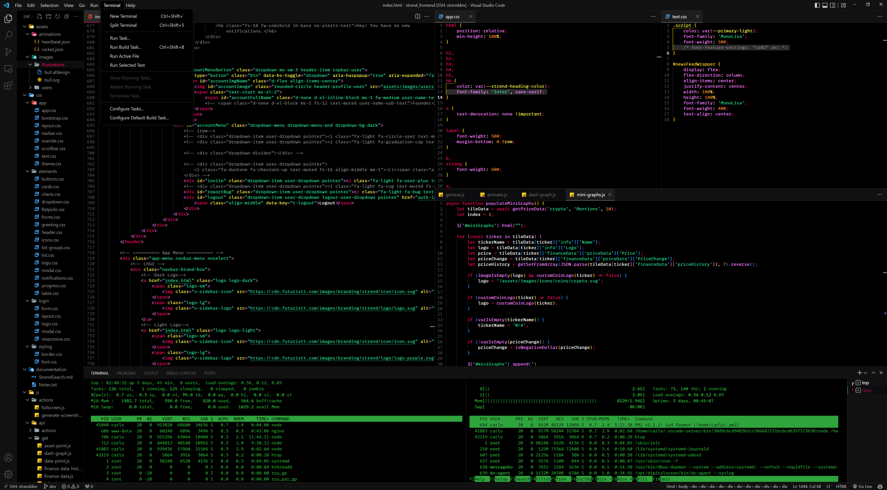
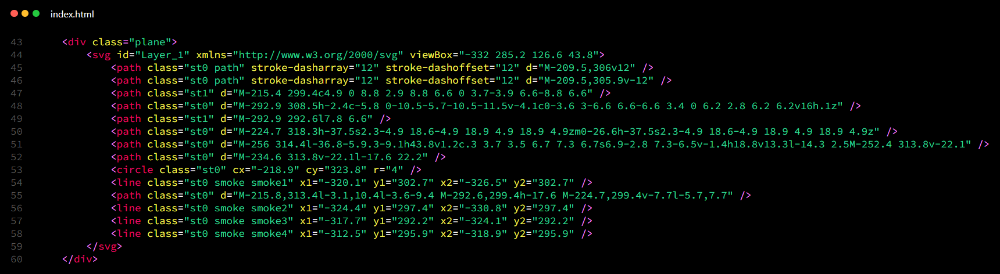
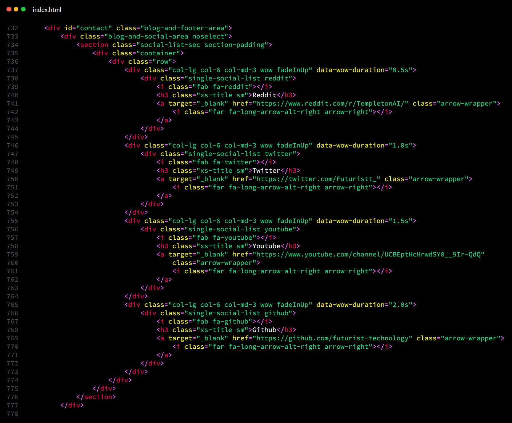
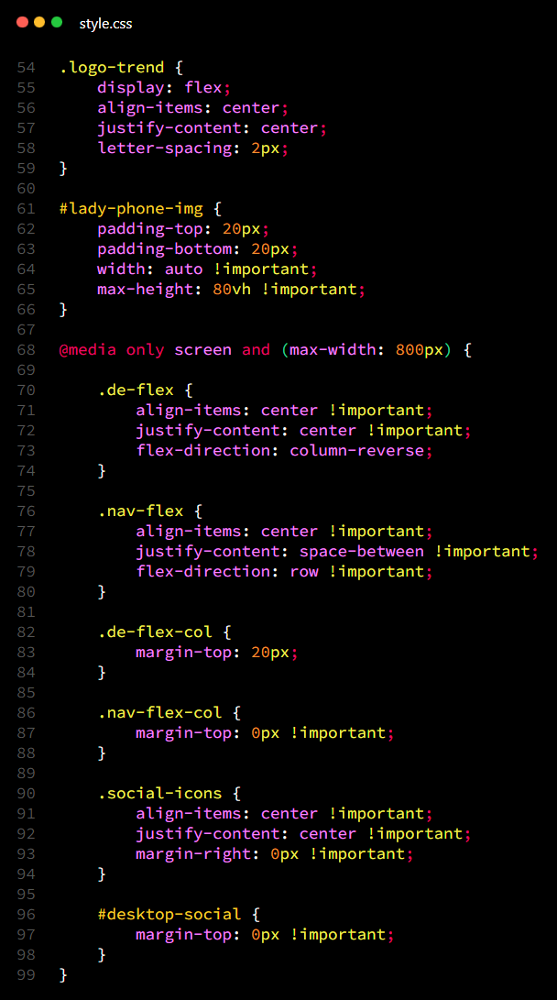
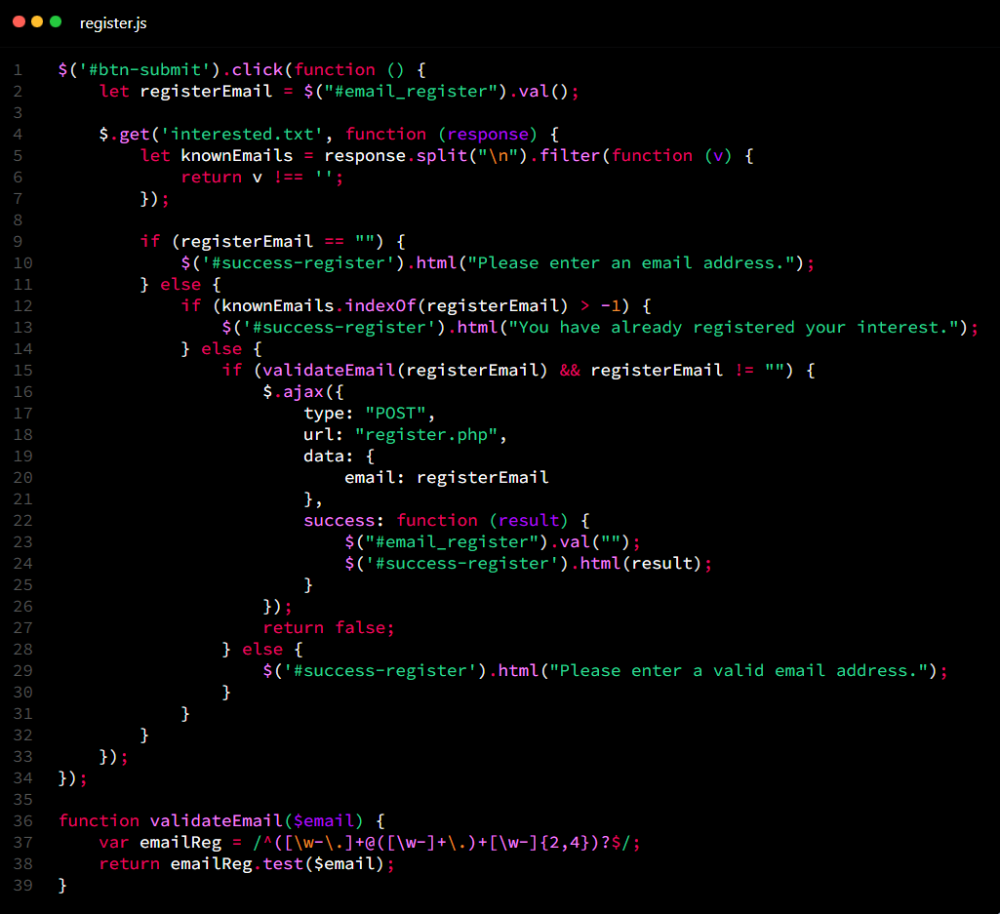

# Futuristt for [Visual Studio Code](http://code.visualstudio.com)
Futuristt is a very dark theme with a cyberpunk inspired syntax highlighting system, matrix style terminal and minimal user interface design principals.

I will be optimising and upgrading this theme as I use it every day. Should you have any requests or fixes, please email at: contact@carlowisse.com

## Installation
Download it from the [Marketplace](https://marketplace.visualstudio.com/items?itemName=carlowisse.futuristt) or on [GitHub](https://github.com/carlowisse/futuristt-theme):

```
git clone https://github.com/carlowisse/futuristt-theme
```

## Supplemental Settings
> there are some supplemental workspace settings that can be used to further enhance the theme. They are available in the [workspace-settings.json](./workspace-settings.json) file.

## Screenshots

### User Interface:


### HTML:

<br><br>


### CSS:


### JS:


## Contact
Built by [Carlo Wisse](https://carlowisse.com)

[LICENSE](https://github.com/carlowisse/Futuristt/blob/master/LICENSE.txt)
